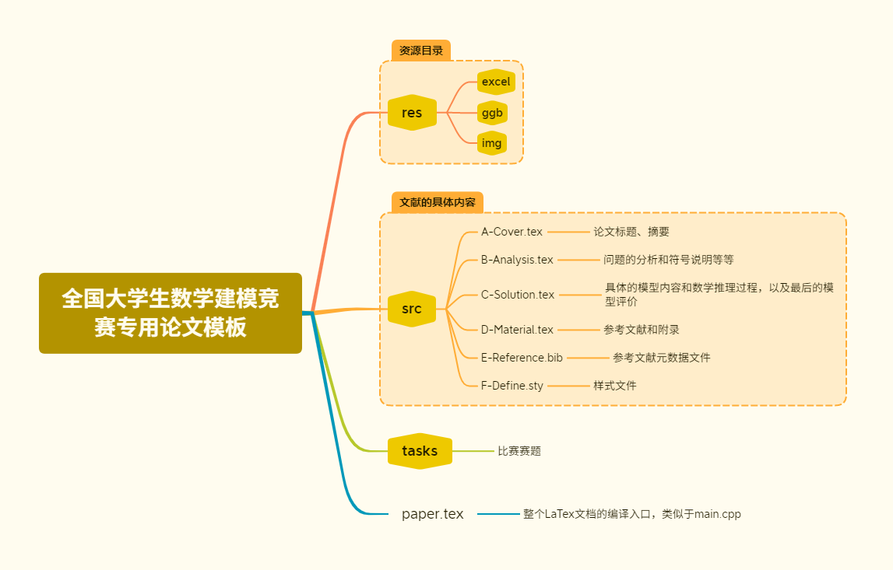

# 全国大学生数学建模竞赛专用论文模板

本项目是针对于全国大学生数学建模竞赛制作的LaTex论文模版。其中包含了常见的论文部分的文件分区，方便多人协同写作与文件存储。并且，针对数学建模论文和中国的语言环境，为论文样式做出了一定的优化，例如把原生的阿拉伯数字标题修改为了中文数字标题，修改了定理环境的字体改为了楷体，使之更加醒目，与其他内容有所区分。而且，能够直接嵌入代码，并且包含中文注释，而不需要更多的调试内容。

在本项目中，所有标题请使用本项目新增的标题语句：`\mcmSection`，该命令与原生的`\section`命令不同的是使用了中文数字标号。其他子标题类似，在原生命令前面添加`mcm`并且首字母大写即可。其他新增环境和命令都可以在`src/F-Define.sty`文件中查看，里面写了详细的注释与使用方法的说明。

不论你是数学建模参赛选手、LaTex学习者，或者其他任何人，希望你们能从本项目中收获到自己想要的东西。

最后，欢迎Star支持！

## 使用指南

本项目是以Visual Studio Code为中心搭建的一套LaTex开发环境，而为了实现前文中所说的代码环境中添加中文，需要进行相关的配置文件修改（具体见`.vscode\settings.json`），所以，你如果使用了其他解决方案，请注意相关内容的修改。

为了解决多人协同时产生的编辑冲突问题，工程文件结构的设计之初就针对数学建模论文里面的主要内容分为了四个大板块，分别对于四个`tex`文件，依次撰写，最大限度避免文档内容过长、修改冲突等问题。

在使用本项目作为你的论文基础框架之前，请仔细查看`F_Define.sty`文件里面的各种新增环境，这能为你接下来的编写有事半功倍的效果。并且在撰写之前，需要了解一些LaTex相关的基本知识，在本项目中，不做过多的追溯，请仔细搜索。

## 文件结构

